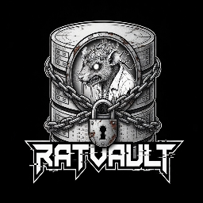

<div align="center">
  
  <h1>RatVault 🐀</h1>
  <p><strong>A terminal-first knowledge vault for managing and querying documents with LLMs</strong></p>
  <p><em>⚠️ Currently in active development. Features and API may change.</em></p>
</div>

RatVault is a simple, open-source knowledge management system that lets you store markdown documents and query them using any LLM provider (OpenAI, Anthropic Claude, Ollama local, OpenRouter, etc).

## ✨ Features

- 🤖 **Multi-LLM Support** — Works with OpenAI, Anthropic (Claude), Ollama (local), OpenRouter, and more  
- 📝 **Simple Markdown Vault** — Store `.md` files and query them with LLMs  
- 🌐 **Web Dashboard** — Clean, minimal interface for browsing documents and chatting  
- ⚡ **Zero Overhead** — Just drop `.md` files in `Notes/` and start querying  
- 🔒 **Privacy First** — Local Ollama support for 100% offline operation  

## 🚀 Quick Start

### 1. Clone & Install

```bash
git clone https://github.com/labrat-0/RatVault.git
cd RatVault
pip install -r requirements.txt
```

### 2. Start the Web Dashboard

```bash
python serve.py
```

Then open `http://localhost:8000` in your browser.

### 3. Add Documents

Drop markdown files into the `Notes/` folder. Each file should have a `.md` extension:

```
Notes/
├── how-to-python.md
├── async-patterns.md
└── ml-concepts.md
```

### 4. Configure Your LLM

Click **Config** in the dashboard sidebar to:
- Choose your provider (Ollama, OpenAI, Anthropic, OpenRouter)
- Select a model
- Enter API key (if needed)

### 5. Start Querying

Go to **Chat** and ask questions about your documents. RatVault automatically includes relevant documents as context for the LLM.

---

## 📁 Document Format

Store documents as simple markdown files in the `Notes/` folder:

```markdown
# My Document Title

Your content here...

## Section

More content...
```

Each document is automatically indexed and made available to the LLM for context-aware responses.

---

## 💻 Configuration

### Provider Setup

**Ollama (Local - Recommended)**
```
Provider: Ollama
Model: mistral (or any model you've pulled)
No API key needed
```

**OpenAI**
```
Provider: OpenAI
Model: gpt-4o-mini
API Key: sk-...
```

**Anthropic (Claude)**
```
Provider: Anthropic
Model: claude-haiku-4-5-20251001
API Key: sk-ant-...
```

**OpenRouter**
```
Provider: OpenRouter
Model: anthropic/claude-3-haiku
API Key: sk-or-...
```

---

## 🌐 Web Dashboard

**Chat** — Query your vault with your configured LLM  
**Vault** — Browse all documents in your knowledge base  
**Config** — Change provider, model, and API key  

---

## 🔒 API Key Safety

- API keys are stored securely on your machine
- Local Ollama requires no API key
- Keys are never sent to third parties (only to the configured LLM provider)

---

## 🛠️ Development

This project is in active development. Features, UI, and APIs may change.

### Current Limitations

- Documents must be in `Notes/` folder
- No automatic document ingestion pipeline yet (manual file addition)
- Web UI is minimal (intentionally)
- Limited to markdown format

### Planned

- Automatic document structuring/enrichment with LLMs
- Obsidian vault integration
- Advanced search and filtering
- Document templates
- Multi-vault support

---

## 🚀 Getting Help

- Check the `Notes/` folder for example documents
- Run `python serve.py --help` for server options
- Open an issue on GitHub

---

## 📜 License

MIT

---

Made with 🖤 by [labrat](https://ratbyte.dev)  
*A simple tool for managing knowledge with language models.*
