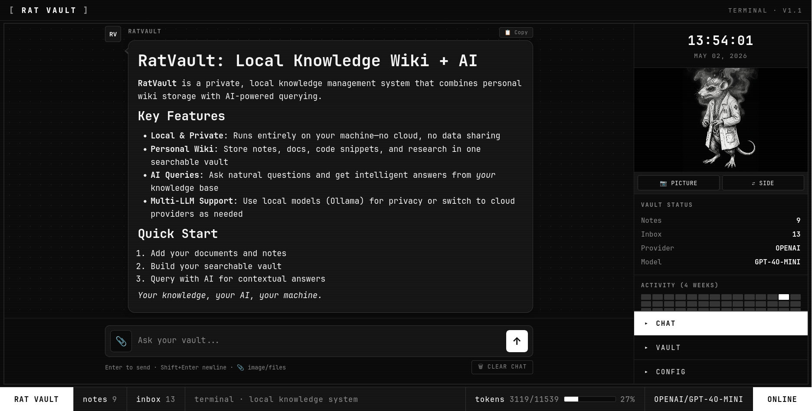

<div align="center">
  
  <h1>RatVault</h1>
  <p><strong>Your local, private, LLM-optional knowledge wiki.</strong></p>
  <p><em>Drop sources in. Get a structured, queryable, cross-referenced wiki out.</em></p>
  <p>
    <a href="#-desktop"></a>
    <a href="#-mobile-termux"></a>
    
    
    
  </p>
</div>



---

## Why RatVault

- **Indexing without a model.** Python-only pipeline turns your inbox into a wiki. No API key, no Ollama, no internet. Add an LLM later if you want richer summaries — never required.
- **Compounding, not fetching.** Inspired by Karpathy's "persistent, compounding knowledge artifact" pattern. Your vault is computed once and kept current — not re-derived on every query.
- **Plain markdown, plain folders.** `Notes/` is regular markdown with YAML frontmatter. Open it directly in **Obsidian** as a vault. No lock-in.
- **Local first.** Runs on your machine. Your data never leaves it unless you point a cloud provider at it.
- **Multi-provider chat.** Ollama, OpenAI, Anthropic, OpenRouter — pick per session. Encrypted-at-rest API keys with master password.
- **Mobile too.** Full pipeline runs in Termux on Android.

---

## How it works

| Layer | What | Purpose |
|---|---|---|
| `inbox/` | Raw sources you drop in | Markdown, text, PDFs, images, videos |
| `Notes/` | Wiki output | One markdown file per entity/concept, YAML frontmatter, cross-refs |
| `assets/` | Extracted media | `images/<slug>/`, `pdfs/<slug>/`, `videos/<slug>/` |
| `config.yaml` | Provider + model | Ollama / OpenAI / Anthropic / OpenRouter / **none** |

**One pipeline, two paths:**

```
inbox/foo.md  ─►  Python indexing (always)  ─►  Notes/foo.md
                  ▲
                  └── (optional) LLM enrichment overlays summary, tags, key concepts
```

If the LLM call fails or no provider is set, the deterministic baseline still writes. Files never get stuck in the inbox.

---

## 🖥 Desktop

### Requirements

- Python **3.10+**
- `pip`
- *(optional)* [Ollama](https://ollama.com) for local LLM enrichment + chat

### 1. Install

```bash
git clone https://github.com/labrat-0/RatVault.git
cd RatVault
pip install -r requirements.txt
```

### 2. Run

```bash
python serve.py
```

Open **http://localhost:8055**.

That's it. No config required for indexing — drop a `.md`, `.pdf`, image, or video into `inbox/` from the dashboard, click **⚙ Reindex Inbox**, and a wiki entry appears in `Notes/`.

### 3. (Optional) Plug in a local model

For richer auto-tagging, summaries, and chat, install [Ollama](https://ollama.com) and pull a model:

```bash
# Recommended for vault enrichment + chat (best balance of quality + speed)
ollama pull mistral:7b-instruct

# Faster but lighter — good for quick edits and small machines
ollama pull phi3:mini

# If your vault is mostly code/scrapers
ollama pull deepseek-coder:6.7b-instruct
```

Then in the dashboard:

1. Open **Config**
2. Provider → **Ollama**
3. Model → click ↻ Fetch and pick `mistral:7b-instruct`
4. Save & Apply

Indexing now overlays LLM-generated summaries and tags on top of the deterministic baseline. Chat hits your local model — no cloud, no key.

> **Recommendation:** start with `mistral:7b-instruct`. It produces clean prose summaries and accurate tags for general notes. Switch to `deepseek-coder:6.7b` if your vault is dominated by code.

### 4. (Optional) Add cloud providers

Encrypted at rest. Master password decrypts keys per session.

1. Open **Config**
2. Set a master password
3. Paste your OpenAI / Anthropic / OpenRouter key in the API Keys panel
4. Save & Apply

The footer shows `🔒 VAULT LOCKED` (red) when keys are encrypted but not unlocked, `🔓 VAULT UNLOCKED` (green) after Unlock. Local providers (Ollama, None) work regardless of lock state.

### 5. Use Obsidian alongside RatVault

`Notes/` is a clean Obsidian vault. Open it directly:

1. Open Obsidian → "Open folder as vault" → pick the `Notes/` directory
2. Wikilinks (`[[other-slug]]`) and frontmatter render natively
3. Edit in Obsidian or the RatVault dashboard — both work on the same files

---

## 📱 Mobile (Termux)

Run the full RatVault pipeline on Android. No root.

### Requirements

- **[Termux](https://f-droid.org/en/packages/com.termux/)** — install from F-Droid (the Play Store version is outdated)
- Android **7.0+**
- ~500 MB free storage

### 1. Set up Termux

```bash
pkg update -y && pkg upgrade -y
pkg install -y python git

# Optional: storage access so you can drop files from your file manager
termux-setup-storage
```

### 2. Clone and install

```bash
cd ~
git clone https://github.com/labrat-0/RatVault.git
cd RatVault
pip install -r requirements.txt
```

> If `pip install` fails on `pypdf` or other native deps, run:
> ```bash
> pkg install -y rust binutils libjpeg-turbo
> pip install -r requirements.txt
> ```

### 3. Run

```bash
python serve.py
```

Open **http://localhost:8055** in your phone's browser. The dashboard is fully responsive — bottom tab bar with Chat / Vault / Profile / Config.

To add files from elsewhere on your phone, use **Profile → Picture** for media or just drag them into `~/RatVault/inbox/` via your file manager (after `termux-setup-storage`).

### 4. Indexing on mobile

**No model needed.** Provider stays at `none` (or `ollama` pointed at your home server) and the Python indexer handles everything.

```bash
# Force pure-Python indexing (no LLM enrichment)
python ingest.py --provider none
```

You get full deterministic frontmatter (title, slug, tags from your input file), media routed to `assets/`, and clean wiki entries — all on your phone, all offline.

### 5. Cloud chat from mobile

Want chat? Paste an OpenRouter or OpenAI key in **Config** the same way as desktop. The encryption flow is identical.

> **Local LLMs in Termux:** Ollama doesn't run natively on Android. If you want local chat from your phone, run Ollama on a desktop on your LAN and point `ollama_base_url` in `config.yaml` to its IP (`http://192.168.x.x:11434`).

---

## CLI

```bash
python ingest.py                       # process inbox/ → Notes/
python ingest.py --dry-run             # preview, no writes
python ingest.py --force               # reprocess everything
python ingest.py --provider none       # pure-Python (no LLM)
python ingest.py --provider ollama     # use local Ollama
python ingest.py --lint                # report orphaned/broken pages
python ingest.py --serve               # launch dashboard
python ingest.py --setup               # interactive config wizard
```

---

## Document format

Every Note in `Notes/` is plain markdown with YAML frontmatter:

```yaml
---
title: "Entity Name"
slug: "entity-slug"
created: "2026-05-04"
ingested_at: "2026-05-04T..."
category: development
tags: [tag1, tag2]
summary: "First-paragraph or LLM-generated summary"
key_concepts: [concept-a, concept-b]
source_file: "input.md"
provider: ollama
model: mistral:7b-instruct
---

# Title

Body content with  and [[other-slug]] links.
```

Compatible with Obsidian, marked, pandoc, and any markdown renderer.

---

## Provider reference

| Provider   | Needs key | Local? | Best for |
|------------|-----------|--------|----------|
| `none`     | no        | n/a    | Pure deterministic indexing — no model at all |
| `ollama`   | no        | yes    | Recommended local default; `mistral:7b-instruct` |
| `openai`   | yes       | no     | Highest-quality enrichment + vision chat |
| `anthropic`| yes       | no     | Long-context summaries (`claude-haiku-4-5`) |
| `openrouter`| yes      | no     | One key, many models (`anthropic/claude-3-haiku`, etc.) |

---

## Security

- `config.yaml`, `.env`, `data/`, `inbox/`, and uploaded `dashboard/assets/profile-*` are all gitignored.
- A **pre-commit hook** (`scripts/pre-commit`) blocks any staged file matching common API-key patterns (`sk-proj-…`, `sk-or-v1-…`, `sk-ant-…`, AWS keys, Google keys). Install on a fresh clone:
  ```bash
  cp scripts/pre-commit .git/hooks/pre-commit
  chmod +x .git/hooks/pre-commit
  ```
- API keys are encrypted with **AES-GCM** in browser localStorage using your master password. They are never sent to the server until you explicitly use them.
- The footer's **🔒 VAULT LOCKED** indicator means: any stored cloud-provider key is currently inaccessible. Local providers (Ollama, None) bypass entirely.

---

## File layout

```
RatVault/
├── inbox/                  # drop sources here (gitignored, append-only)
│   └── .archive/           # auto-archived after successful indexing
├── Notes/                  # the wiki — plain markdown, Obsidian-compatible
├── assets/
│   ├── images/<slug>/      # extracted from inbox media
│   ├── pdfs/<slug>/
│   └── videos/<slug>/
├── dashboard/              # vanilla JS web UI
├── pipeline/               # parser, providers, media, prompts, writer, lint
├── data/                   # ingest_state.json (dedup cache)
├── config.yaml             # provider + model (gitignored)
├── ingest.py               # main pipeline entry
└── serve.py                # FastAPI dashboard server (port 8055)
```

---

## Endpoints (FastAPI)

| Method | Path | Purpose |
|---|---|---|
| GET  | `/api/entries` / `/api/entries/{slug}` | List / fetch wiki entries |
| GET  | `/api/search?q=` | Full-text search |
| GET  | `/api/inbox` | List inbox files |
| POST | `/api/inbox/upload` | Upload file to inbox |
| POST | `/api/inbox/save-edit` | Save wiki edit back to inbox for re-ingest |
| GET  | `/api/inbox/file/{name}` | Inline serve (PDF/image/video preview) |
| DELETE | `/api/inbox/{name}` | Remove inbox file |
| POST | `/api/reindex` | Run `ingest.py` |
| GET/POST | `/api/config` | Read/write provider config |
| POST | `/api/chat` | RAG chat (vault context + optional images) |
| GET/POST | `/api/profile` | Sidebar profile media |
| GET  | `/assets/{path}` | Serve repo `assets/` |

---

## Roadmap

- [x] Python-first indexing with optional LLM overlay
- [x] Mobile-responsive dashboard (bottom tabs, no slide drawer)
- [x] Master-password-encrypted cloud keys
- [x] Auto-archive indexed inbox sources
- [ ] Full lint pass (orphan refs, contradictions)
- [ ] Embedding index for semantic search
- [ ] One-tap Termux installer

---

## License

MIT — © labrat. Built for fast, local, private knowledge work.
